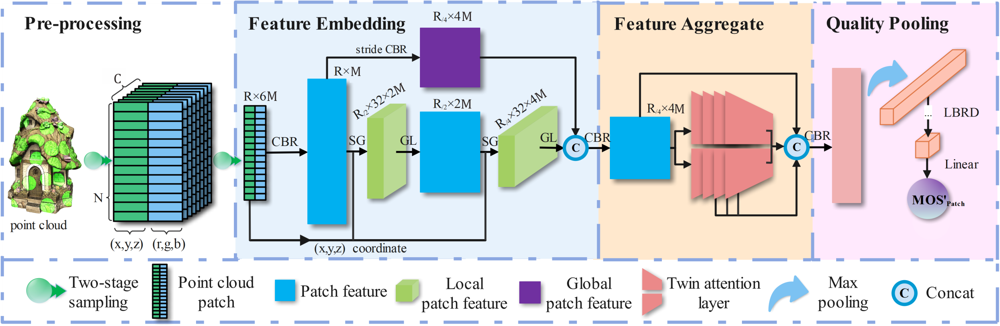
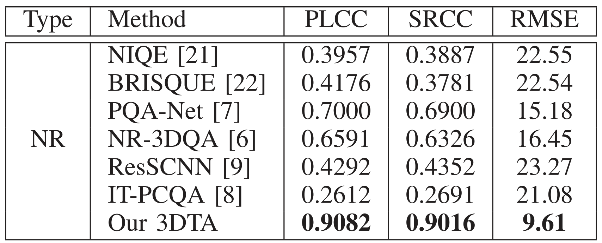

# 3DTA-PCQA
Paper: [3DTA: No-Reference 3D Point Cloud Quality Assessment with Twin Attention](https://ieeexplore.ieee.org/abstract/document/10542438)

Journal: IEEE Transactions on Multimedia

<div align="center">
  
</div>

# Performance on WPC Datasets

<div align="center">
  
</div>

# Running experiment
### 1. Download Code
   Download this github repository to your computer, with the following folder structure:

```sh
———— 📁 code
———————— 🐍 1.1pc_to_patch.py
———————— 🐍 1.2patch_list_create.py
———————— 🐍 1.3main.py
———————— 🐍 data_load.py
———————— 🐍 model_3DTA.py
———————— 🐍rename_error_file.py
———————— 🐍 util.py
———— 📁 data
———————————— 🔢 mos.xls
———————————— 🔢 test.xls
———————————— 🔢 train.xls
———— 📁 images
———— 📰 README.md
```

### 2. Data Preparation
   Download the WPC datasets from <https://github.com/qdushl/Waterloo-Point-Cloud-Database>, and copy all the distorted 740 ply files into ./data/WPC/Distortion_ply folder. All files are in the same folder.
   We have prepared the dataset segmentation file: mos.xls、test.xls、train.xls.

### 3. Install Dependencies
   Please install CUDA and cudnn in advance. Our code can only run on GPU at present. In addition, Anaconda is recommended. Python >= 3.8 is required, and the Python libraries that need to be installed are as follows:

```python
torch
tqdm
xlrd
argparse
numpy
pandas
plyfile
multiprocessing
sklearn
scipy
open3d
```

The above Python libraries are sufficient as long as they do not conflict with each other and do not require specific versions.

### 4. Run Code
Run the code one by one to obtain the experimental results:

```
1. pc_to_patch.py
2. patch_list_create.py
3. main.py
```

## Bibtex
If this work is helpful for your research, please consider citing the following BibTeX entry.
```bibtex
@article{zhu20243dta,
  title={3DTA: No-reference 3D point cloud quality assessment with twin attention},
  author={Zhu, Linxia and Cheng, Jun and Wang, Xu and Su, Honglei and Yang, Huan and Yuan, Hui and Korhonen, Jari},
  journal={IEEE Transactions on Multimedia},
  year={2024},
  publisher={IEEE}
}
```
